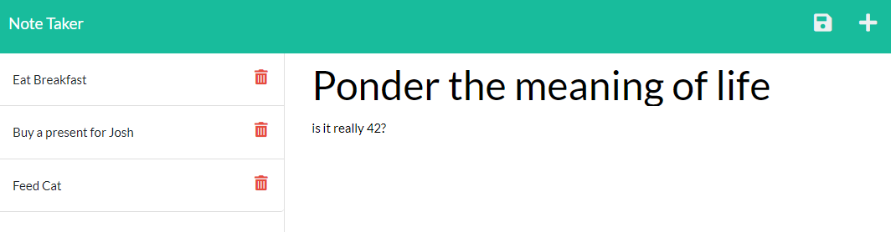
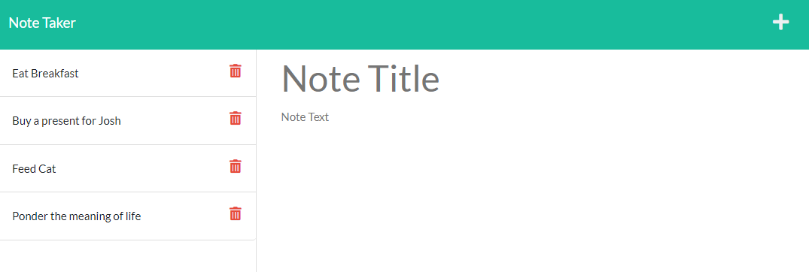
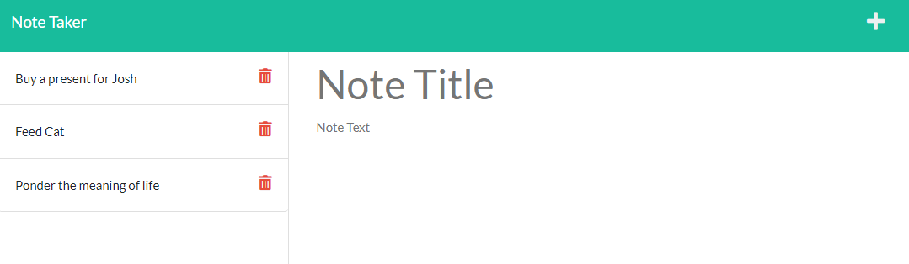

# Notetaker App
[Live Site on heroku](https://murmuring-wave-96406.herokuapp.com/)

## Table of Contents
1. [Summary](#Summary)
2. [Visual](#Visual)

## Summary
You are able to add simple notes with a title and text body, as well as delete them. The notes are saved to a json file.

## Visual

Adding a new note

New note is shown on the sidebar

A deleted note is removed from the sidebar